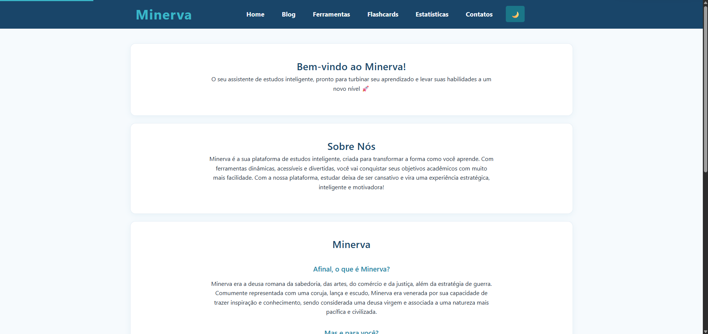
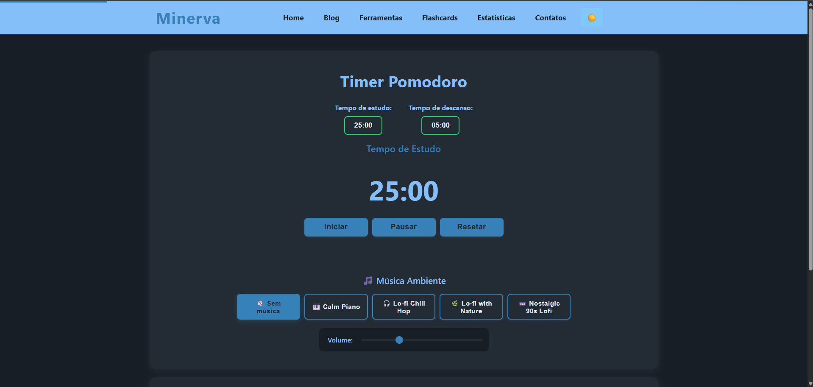
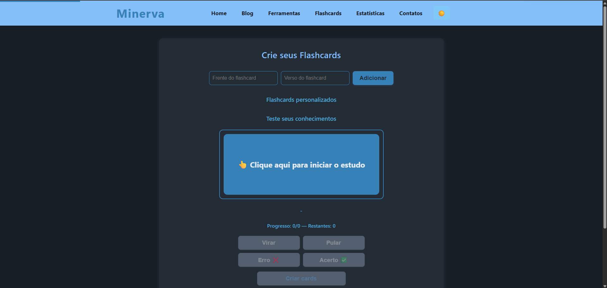
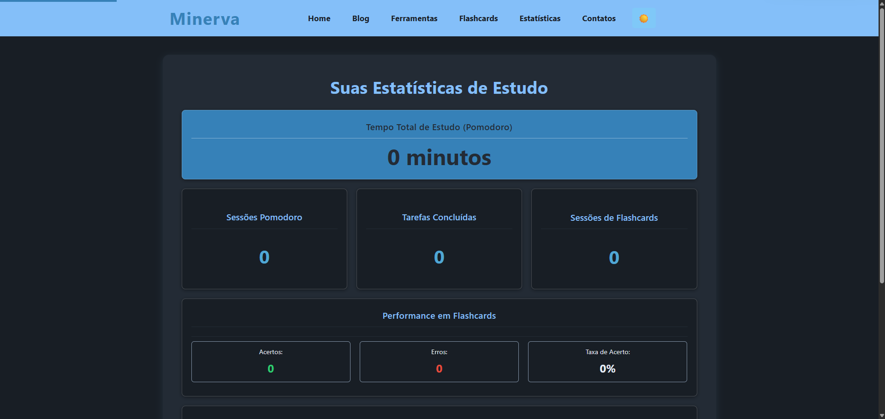

# 🦉 Minerva - Plataforma de Estudos Inteligente


## 📖 Sobre o Projeto

**Minerva** é uma plataforma web completa de estudos, criada para transformar a forma como você aprende. Inspirada na deusa romana da sabedoria, Minerva oferece ferramentas dinâmicas, acessíveis e gamificadas que tornam o aprendizado mais estratégico, eficiente e motivador.

### ✨ Principais Características

- 🍅 **Timer Pomodoro** com música ambiente Lo-fi
- 📝 **Sistema de Checklist** para organização de tarefas
- 🃏 **Flashcards Personalizados** com sistema de repetição espaçada
- 📊 **Estatísticas de Estudo** para acompanhar seu progresso
- 📚 **Blog Educativo** com artigos sobre técnicas de estudo
- 🌙 **Modo Escuro** para conforto visual
- ♿ **Totalmente Acessível** (WCAG 2.1 AA)
- 📱 **Design Responsivo** para todos os dispositivos
- 🔔 **Sistema de Notificações** com feedback visual

---

## 🚀 Demonstração

> 🚧 **Em breve:** Link da demo será adicionado após o deploy

### 📸 Screenshots






---

## 🛠️ Tecnologias Utilizadas

### Frontend
- **HTML5** - Estrutura semântica
- **CSS3** - Estilização moderna com variáveis CSS
- **JavaScript (Vanilla)** - Funcionalidades interativas

### Recursos
- **LocalStorage API** - Persistência de dados local
- **Web Audio API** - Sistema de sons e música
- **CSS Grid & Flexbox** - Layout responsivo
- **Custom Properties** - Temas claro/escuro

### Bibliotecas de Áudio
- Lo-fi Music Collection (MP3)
- Sound Effects personalizados

---

## 📂 Estrutura do Projeto

```
minerva/
│
├── index.html              # Página inicial
├── blog.html               # Lista de posts do blog
├── post.html               # Template de post individual
├── ferramentas.html        # Pomodoro e Checklist
├── flashcards.html         # Sistema de flashcards
├── estatisticas.html       # Dashboard de estatísticas
├── contato.html            # Formulário de contato
├── style.css               # Estilos globais
│
├── JS/
│   ├── main.js             # Script principal e menu
│   ├── pomodoro.js         # Timer Pomodoro
│   ├── checklist.js        # Sistema de tarefas
│   ├── flashcard.js        # Gerenciamento de flashcards
│   ├── statistics.js       # Tracking de estatísticas
│   ├── blog.js             # Listagem de posts
│   ├── blog-posts.js       # Conteúdo dos posts
│   ├── post.js             # Renderização de post individual
│   ├── darkmode.js         # Toggle modo escuro
│   ├── notifications.js    # Sistema de notificações toast
│   ├── seo.js              # Meta tags e SEO
│   └── accessibility.js    # Melhorias de acessibilidade
│
├── audio/
│   ├── calm-piano.mp3
│   ├── lofi-chill-hop.mp3
│   ├── lofi-sounds-of-nature.mp3
│   ├── nostalgic-90s-lofi.mp3
│   ├── correct.mp3         # Som de acerto
│   ├── wrong.mp3           # Som de erro
│   └── notification.mp3    # Som de notificação
│
├── imagens/
│   └── [imagens do blog e interface]
│
└── README.md
```

---

## 🎯 Funcionalidades Detalhadas

### 1. Timer Pomodoro 🍅

- Personalize tempos de estudo e descanso (formato MM:SS)
- 5 opções de música ambiente Lo-fi
- Controle de volume integrado
- Notificações sonoras e visuais
- Tracking automático de sessões

**Uso:**
```javascript
// Configuração padrão
Tempo de Estudo: 25:00
Tempo de Descanso: 05:00

// O timer alterna automaticamente entre estudo e descanso
```

### 2. Sistema de Checklist ✅

- Adicione tarefas rapidamente
- Marque como concluída com feedback sonoro
- Persistência local dos dados
- Tracking de tarefas concluídas

**Atalhos:**
- `Enter` - Adicionar tarefa

### 3. Flashcards 🃏

**Características:**
- Criação ilimitada de cards personalizados
- Sistema de virar card com animação 3D
- Modo de estudo com marcação de acertos/erros
- Sons diferenciados para feedback
- Repetição espaçada automática (cards errados voltam para a fila)
- Estatísticas de performance

**Controles no Modo Estudo:**
- `Virar` - Ver verso do card
- `Pular` - Próximo card sem avaliar
- `Acerto ✅` - Remove da fila
- `Erro ❌` - Volta para o final da fila

### 4. Estatísticas 📊

**Métricas Acompanhadas:**
- ⏱️ Tempo total de estudo (Pomodoro)
- 🍅 Número de sessões Pomodoro
- ✅ Tarefas concluídas
- 🃏 Sessões de flashcards
- 📈 Taxa de acerto em flashcards
- 📜 Histórico recente de atividades

### 5. Blog Educativo 📚

**6 Artigos Completos:**
1. Sete Métodos de Estudo que Realmente Funcionam
2. Como Organizar um Plano de Estudos Personalizado
3. Gamificação: Como Torna o Estudo Mais Inteligente
4. Dicas Práticas para Mandar Bem no Vestibular
5. Produtividade nos Estudos: Como Evitar a Procrastinação
6. Saúde Mental e Bem-Estar Durante os Estudos

---

## ♿ Acessibilidade

Minerva foi desenvolvido seguindo as diretrizes **WCAG 2.1 nível AA**:

### ✅ Recursos Implementados

- **Navegação por Teclado**
  - `Tab` - Navegar entre elementos
  - `Enter/Space` - Ativar botões e cards
  - `Escape` - Fechar menu mobile
  - `Ctrl/Cmd + K` - Focar no input principal

- **Screen Readers**
  - Atributos ARIA completos
  - Live regions para atualizações dinâmicas
  - Labels descritivos em todos os controles
  - Hierarquia semântica de headings

- **Visual**
  - Contraste de cores adequado (AAA onde possível)
  - Foco visível em todos os elementos interativos
  - Áreas de toque mínimas de 44x44px
  - Suporte a `prefers-reduced-motion`
  - Suporte a `prefers-contrast: high`

- **Menu Mobile**
  - Trap de foco quando aberto
  - Fechamento com ESC
  - Overlay semitransparente
  - Animações suaves

---

## 🎨 Temas

### Modo Claro (Padrão)
```css
Background: #F6FAFD
Texto: #222E3A
Destaque: #2386A6
Acento: #3AB7C8
```

### Modo Escuro
```css
Background: #181E25
Texto: #E4EBF5
Destaque: #50A7D4
Acento: #3681B8
```

A preferência é salva automaticamente no `localStorage`.

---

## 💾 Armazenamento de Dados

Todos os dados são armazenados localmente no navegador usando `localStorage`:

```javascript
// Dados armazenados:
- tarefas           // Array de tarefas do checklist
- flashcards        // Array de flashcards criados
- darkMode          // Preferência de tema (true/false)
- minerva_study_stats // Objeto com todas as estatísticas
```

**⚠️ Importante:** Os dados não são sincronizados entre dispositivos e podem ser perdidos ao limpar o cache do navegador.

---

## 🚀 Como Usar

### Instalação Local

1. **Clone o repositório**
```bash
git clone https://github.com/Web-Design-Semestre2/minerva
cd minerva
```

2. **Abra o projeto**
```bash
# Opção 1: Abrir index.html diretamente no navegador

# Opção 2: Usar um servidor local
# Com Python 3:
python -m http.server 8000

# Com Node.js (http-server):
npx http-server -p 8000

# Com PHP:
php -S localhost:8000
```

3. **Acesse no navegador**
```
http://localhost:8000
```

### Requisitos

- Navegador moderno (Chrome 90+, Firefox 88+, Safari 14+, Edge 90+)
- JavaScript habilitado
- LocalStorage disponível

---

## 🎵 Adicionando Novas Músicas

Para adicionar mais músicas Lo-fi ao Pomodoro:

1. Adicione o arquivo MP3 na pasta `audio/`
2. Edite `JS/pomodoro.js`:

```javascript
const musicas = {
    // ... músicas existentes
    nova_musica: { 
        nome: "🎵 Nome da Música", 
        url: "audio/sua-musica.mp3" 
    }
};
```

3. Adicione o botão em `ferramentas.html`:

```html
<button class="music-btn" data-music="nova_musica">
    🎵 Nome da Música
</button>
```

---

## 📝 Adicionando Novos Posts no Blog

Edite o arquivo `JS/blog-posts.js`:

```javascript
const blogPosts = [
  {
    id: "7",
    slug: "titulo-do-post",
    title: "Título do Post",
    date: "DD/MM/AAAA",
    summary: "Resumo breve do post",
    content: `
      
      
      <p>Conteúdo do post em HTML...</p>
      
      <h3>Subtítulo</h3>
      <p>Mais conteúdo...</p>
    `
  },
  // ... posts existentes
];
```

---

## 🔧 Personalização

### Alterar Cores do Tema

Edite as variáveis CSS em `style.css`:

```css
:root {
    --color-bg: #F6FAFD;          /* Fundo principal */
    --color-title: #194569;       /* Títulos */
    --color-accent: #3AB7C8;      /* Cor de destaque */
    --color-button: #2386A6;      /* Botões */
    /* ... outras variáveis */
}
```

### Modificar Tempo Padrão do Pomodoro

Edite `JS/pomodoro.js`:

```javascript
let tempoEstudo = 25 * 60;      // 25 minutos (em segundos)
let tempoDescanso = 5 * 60;     // 5 minutos (em segundos)
```

### Alterar Duração das Notificações

Edite `JS/notifications.js`:

```javascript
setTimeout(() => {
    // ... código de remoção
}, 3000);  // Altere 3000 para a duração desejada em ms
```

---

## 🐛 Problemas Conhecidos

### Áudio não reproduz automaticamente
**Causa:** Políticas de autoplay dos navegadores modernos  
**Solução:** O usuário precisa interagir com a página primeiro (clicar em qualquer lugar)

### Dados perdidos após limpar cache
**Causa:** Uso de localStorage  
**Solução:** Futuras versões terão backup/export de dados

### Menu mobile não fecha no iOS Safari antigo
**Causa:** Compatibilidade limitada  
**Solução:** Atualizar navegador ou usar versão desktop

---

## 🗺️ Roadmap

### Versão 1.1 (Próxima)
- [ ] Export/Import de dados
- [ ] Modo offline (PWA)
- [ ] Mais temas de cores
- [ ] Timer de intervalo longo (Pomodoro tradicional)

### Versão 1.2
- [ ] Sistema de conquistas/badges
- [ ] Gráficos de progresso
- [ ] Integração com Google Calendar
- [ ] Sincronização na nuvem (opcional)

### Versão 2.0
- [ ] Sistema de conta de usuário
- [ ] Modo colaborativo (estudar com amigos)
- [ ] Integração com Notion/Trello
- [ ] App mobile nativo

---

## 🤝 Contribuindo

Contribuições são bem-vindas! Para contribuir:

1. Faça um Fork do projeto
2. Crie uma branch para sua feature (`git checkout -b feature/NovaFuncionalidade`)
3. Commit suas mudanças (`git commit -m 'Adiciona nova funcionalidade'`)
4. Push para a branch (`git push origin feature/NovaFuncionalidade`)
5. Abra um Pull Request

### Diretrizes

- Mantenha o código limpo
- Siga os padrões de acessibilidade WCAG 2.1
- Teste em múltiplos navegadores
- Atualize a documentação se necessário

---

## 📄 Licença

Este projeto está sob a licença MIT. Veja o arquivo [LICENSE](LICENSE) para mais detalhes.

```
MIT License

Copyright (c) 2025 Minerva

Permission is hereby granted, free of charge, to any person obtaining a copy
of this software and associated documentation files (the "Software"), to deal
in the Software without restriction, including without limitation the rights
to use, copy, modify, merge, publish, distribute, sublicense, and/or sell
copies of the Software, and to permit persons to whom the Software is
furnished to do so, subject to the following conditions:

[Texto completo da licença MIT]
```

---

## 👥 Autores

- **Equipe Minerva** - *Desenvolvimento* - [@Web-Design-Semestre2](https://github.com/Web-Design-Semestre2)

---

## 🙏 Agradecimentos

- Inspiração na deusa romana Minerva
- Comunidade de desenvolvedores open-source
- Pesquisas em neurociência do aprendizado
- Feedback de estudantes beta-testers

---

## 📞 Suporte

Encontrou um bug? Tem uma sugestão?

- 📧 Email: [contato@minerva.com](#)
- 🐛 Issues: [GitHub Issues](#)
- 💬 Discussões: [GitHub Discussions](#)

---

## 🌟 Mostre seu apoio

Se este projeto te ajudou, considere dar uma ⭐️ no GitHub!

---

<div align="center">
  
**[⬆ Voltar ao topo](#-minerva---plataforma-de-estudos-inteligente)**

Feito com 💙 pela equipe Minerva

</div>
